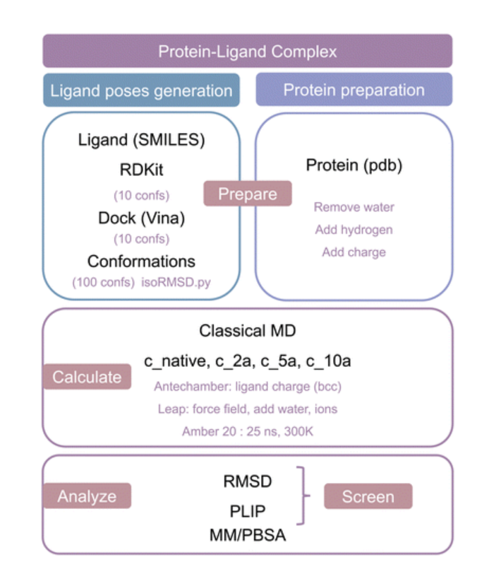

# moira
RMSD, MMPBSA, PLIP analyses for molecular dynamic trajectory

Getting started
1. Install Amber 20
2. Install environments

Tutorials
1. Analyze pdbbind dataset (pdbbind_analysis)
2. implement molecular docking (dock_suite)
3. implement MD calculations (md_suite)
4. calculate RMSD (rmsd_suite)
5. calculate PLIP (plip_suite)
6. calculate MMPBSA binding energy (mmpbsa_suite) 
7. comprehensive analysis (Moira.ipynb)

References
